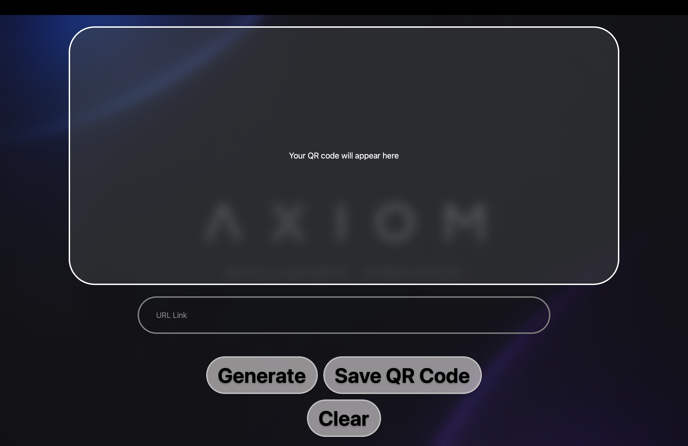

# QR Code Generator

  

  Modern QR code generator for Windows and macOS.

---

## Author

- Alec Ortiz

---

## Features

- Generate QR codes from URLs
- Native desktop support
- Modern minimal interface
- Fast lightweight performance
- Windows and macOS support

---

## Tech Stack

- React Native
- Expo
- JavaScript (JSX)
- Tauri

---

## Downloads

---

## Supported Platforms

- Windows 11
- macOS

---

## Upcoming Features

- Custom QR colors
- Saved QR history
- Batch QR generation
- Custom QR Logos

---

## Installation

### Windows

Download and run the included `.exe` installer.

### macOS

Download and open the included `.dmg` installer.

---

## License

N/A
